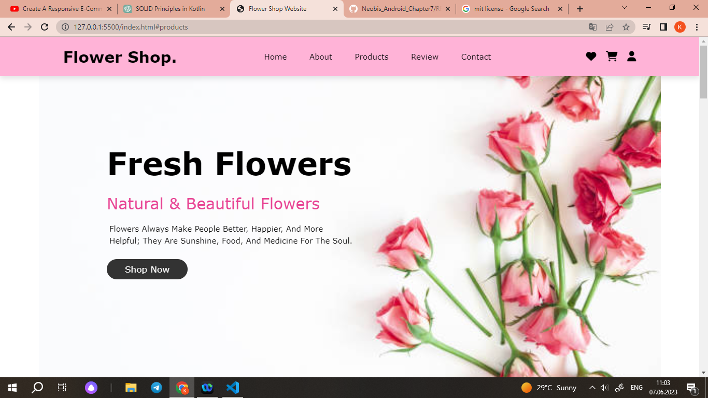
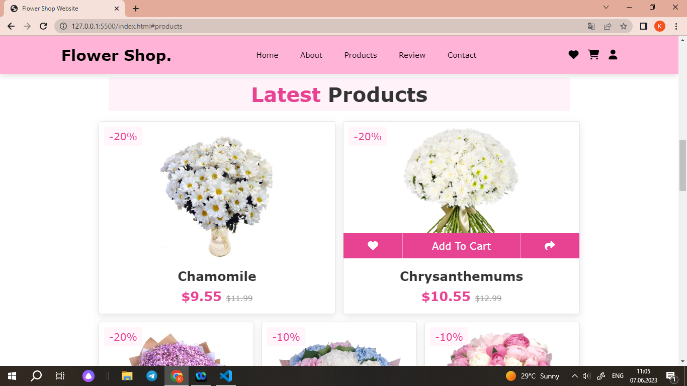
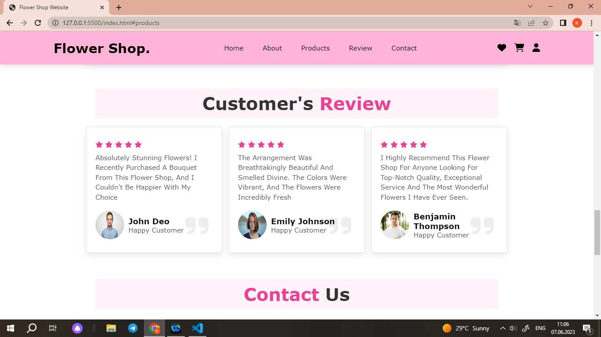
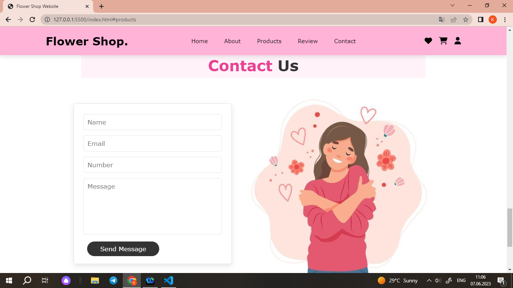

# Flowers Shop Website

This Flower Shop Website is a simple educational project created using only HTML and CSS. It serves as a demonstration of building a static website for a flower shop, showcasing various sections such as home, about, products, customer reviews, and contact.

## Features
- Responsive design that adapts to different screen sizes.
- Navigation menu for easy access to different sections of the website.
- Sections including home, about, products, customer reviews, and contact.
- Interactive elements such as buttons and hover effects.
- Beautifully styled components and layout using CSS.

## Pictures

## License
The MIT License (MIT)
Copyright (c) 2023 Kamila Rybakova